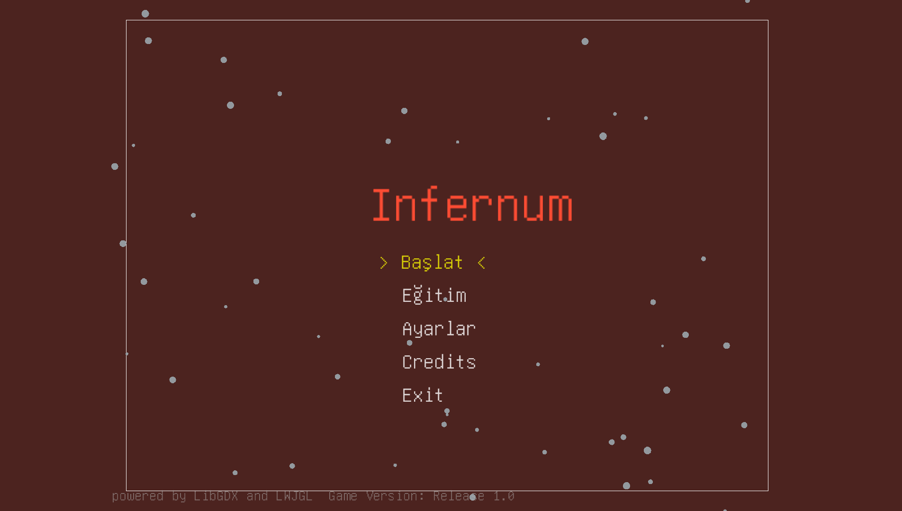
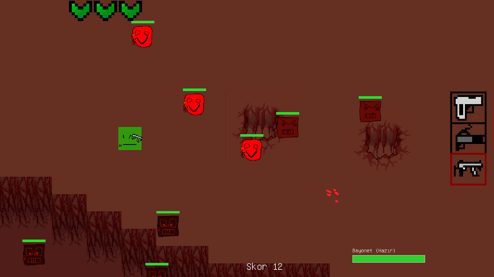

# INFERNUM

> A top-down survival shooter built with **Java + LibGDX**.  
> Survive endless waves of enemies. Use the right weapon on the right enemy.

---

## 🇬🇧 English

### Screenshots



---

### Features

- **Top-down twin-stick shooter** — keyboard + mouse or gamepad
- **3 enemy types**, each weak to a different weapon
- **3 ranged weapons** + **1 melee (bayonet)**
- Blood particles & dust effects
- Score-based difficulty scaling — enemies spawn faster as you score
- Bayonet mechanic — kill 2+ enemies at once to regenerate HP
- Difficulty settings: **Normal**, **Hard**, **Ben Erlik Han'ım**
- Tiled map with collision layers & custom shaders
- Sound effects for every weapon and enemy type

---

### Weapon x Enemy Matchup

This game has a **rock-paper-scissors** damage system.  
Each enemy type has one weapon that shreds it — and weapons that barely scratch it.

| Enemy | Name | Best Weapon | Damage | Other Weapons |
|-------|------|------------|--------|---------------|
| Type 1 | Günahkâr *(Sinner)* | **SMG** `[3]` | 15 dmg/bullet | Shotgun: 2 • Pistol: 3 |
| Type 2 | Zırhlı Robot *(Armored Robot)* | **Shotgun** `[2]` | 30 dmg/bullet | SMG: 5 • Pistol: 14 |
| Type 3 | Uyuşturucu Bağımlısı *(Addict)* | **Pistol** `[1]` | 8 dmg/bullet | SMG: 2 • Shotgun: 1 |

> **Bayonet** (Right click / RB) — instant kill in melee range, works on all types.  
> Kill 2+ with one swing → **+1 HP regen**. Kill 3+ → **+2 HP regen**.

---

### Controls

| Action | Keyboard + Mouse | Gamepad |
|--------|-----------------|---------|
| Move | `WASD` | Left Stick |
| Aim | Mouse | Right Stick |
| Shoot | `Left Click` | `RT` |
| Bayonet | `Right Click` | `RB` |
| Switch weapon | `1` / `2` / `3` | — |
| Pause / Back | `ESC` | `B` |
| Quit | `Q` | — |

---

### How to Run

**Requirements:** Java 17+, Gradle

```bash
git clone https://github.com/pbodyMRTF/infernum.git
cd infernum
./gradlew run
```

Or run the pre-built JAR:

```bash
java -jar build/dist/benim-oyunum-1.0-dist.jar
```

---

### Built With

- [LibGDX](https://libgdx.com/) game framework
- [Tiled](https://www.mapeditor.org/) map editor

---

---

## 🇹🇷 Türkçe

### Ekran Görüntüleri


---

### Özellikler

- **Yukarıdan bakış nişancı oyunu** — klavye + fare veya gamepad
- **3 farklı düşman tipi**, her biri farklı silaha karşı zayıf
- **3 menzilli silah** + **1 yakın dövüş (bayonet)**
- Kan ve toz parçacık efektleri
- Skora bağlı zorluk artışı — öldürdükçe düşmanlar hızlanır
- Bayonet mekaniği — aynı anda 2+ öldürünce can yenilenir
- Zorluk seviyeleri: **Normal**, **Zor**, **Ben Erlik Han'ım**
- Çarpışma katmanlı Tiled harita ve özel GLSL shader'lar
- Her silah ve düşman için ses efekti

---

### Silah x Düşman Eşleşmesi

Oyunda bir **taş-kâğıt-makas** hasar sistemi var.  
Her düşman tipinin bir zayıf noktası var — yanlış silahla çok az hasar verirsin.

| Düşman | İsim | En İyi Silah | Hasar | Diğer Silahlar |
|--------|------|-------------|-------|----------------|
| Tip 1 | Günahkâr | **SMG** `[3]` | 15 hasar/mermi | Pompalı: 2 • Tabanca: 3 |
| Tip 2 | Zırhlı Robot | **Pompalı** `[2]` | 30 hasar/mermi | SMG: 5 • Tabanca: 14 |
| Tip 3 | Uyuşturucu Bağımlısı | **Tabanca** `[1]` | 8 hasar/mermi | SMG: 2 • Pompalı: 1 |

> **Bayonet** (Sağ tık / RB) — yakın mesafede anlık öldürme, tüm tiplere karşı çalışır.  
> 1 vuruşta 2+ öldür → **+1 can yenilenir**. 3+ öldür → **+2 can yenilenir**.

---

### Kontroller

| Eylem | Klavye + Fare | Gamepad |
|-------|--------------|---------|
| Hareket | `WASD` | Sol Analog |
| Nişan | Fare | Sağ Analog |
| Ateş | `Sol Tık` | `RT` |
| Bayonet | `Sağ Tık` | `RB` |
| Silah değiştir | `1` / `2` / `3` | — |
| Geri / Duraklat | `ESC` | `B` |
| Çıkış | `Q` | — |

---

### Nasıl Çalıştırılır

**Gereksinimler:** Java 17+, Gradle

```bash
git clone https://github.com/pbodyMRTF/infernum.git
cd infernum
./gradlew run
```

Ya da hazır JAR ile:

```bash
java -jar build/dist/benim-oyunum-1.0-dist.jar
```

---

### Kullanılan Teknolojiler

- [LibGDX](https://libgdx.com/) oyun framework'ü
- [Tiled](https://www.mapeditor.org/) harita editörü